# Fase 1: Planificación del Proyecto (Wireframe y Estructura HTML)

## 1. **Análisis de requisitos y objetivos del proyecto:**
Nuestro proyecto va a tratar de una tienda de merchandising sobre articulos de boxeo, una tienda llamada BoxingMerch. En esta tienda vamos a encontrar funcionalidades como, iniciar sesión, cerrar sesión, ir a la cesta, comprar los articulos de la cesta dar like a un articulo y que asi se guarde en la cesta. Tendra un navegador con varios botones los cuales te permitiran ir navegando por la web, tengo pensado hacer una última página que deje recomendaciones de gimnasios donde se práctique boxeo, y esten afiliados con mi tienda. 

La funcionalidad básica que debe ofrecer es brindarle usabilidad al usuario, que le sea fácil navegar por la web, que sea legible y tenga un sentido tanto para el usuario, como para el lector web, brindando así accesibilidad a nuestro código.

Para ello, haremos uso de **HTML5** para la estructura de la web, **CSS3** para el diseño, **Balsamiq** para los wireframes y por ultimo **git** como controlador de versiónes y **github** para subir el repositorio de nuetro proyecto, en el que hacemos uso de **Markdown** para toda información que se ve en esta página ;).

2. **Creación de un wireframe en Balsamiq:**
#### [Wireframe del proyecto](Wireframe_Proyecto_LGDM.pdf)

3. **Estructura HTML planificada:**

Mi proyecto seguirá una estructura, la cual será la siguiente: head, donde se encontrara todos los meta del documento. Un body el cual incluye: 
- Un Header, en el cual encontramos el NAV, es decir el navegador de la web, junto al logo, y en algunas encontraremos el carrito de la compra y el logo del perfil, vaya, en todas menos en login y register.

- Un Main, en el que tendremos todo el contenido de la web, dependiendo claramente de que conste cada página (en el haremos uso de sections, labels, articles, aside (para los filtros), etc).

- Un footer, en el que encontraremos lineas de contactos con la empresa, redes sociales, metodos de pago, etc.

# Fase 2: Diseño y Desarrollo del Frontend (HTML y CSS).

En el periodo de toda esta fase, nos enfocamos en la generación de la Página web, en la cual como comentamos hacemos uso de HTML5 y CSS3. La estructuración de este proyecto, por mi parte es la siguiente:

    -PROYECTO-LGDM
        > assets
            > icons
            > img
            > video
        > css_scss
        > js (no hacemos uso de js en este proyecto, pero ahi está para mas adelante)
        > views

    archivos.html...

**IMPORTANTE:** Quiero aclarar que la estructura en cuanto a los códigos del CSS será diferente a la de mis compañeros, no sera incorrecta, pero tampoco del todo correcta, para el código que se repite, en mi caso header y footer, genere una hoja de estilos llamada header_footer.css, de forma que a cada CSS se le aplica tanto esa hoja de estilo como la suya propia de su diseño, es decir, el diseño de lo que seria el main.

**Cumplimos** con todos los **requerimentos** que la práctica pide, hemos realizado un diseño **responsive**, cuidando al minimo detalle que sea comodo para todos los dispositivos y navegadores.

Tenemos menus, formularios, transiciones, desplegables, imagenes, etc, etc...

# Fase 3: Implementación y Validación del Código

**1. Validación del Código HTML**

**IMPORTANTE:** A lo largo de este apartado de validaciones, vamos a ver en todo momento un warning de h1 y h2-h6, realmente no ocurre nada, son como avisos que te indican que realmente un article deberia llevar un titulo cada vez que se usa esta etiqueta.

-----

- La siguiente imagen, es la validación del código LOGIN, bien, sinceramente no obtuve errores, este fue el que obtuve, y lo hice a sabiendas que iba a ocurrir, ya que la funcion del boton login es de tipo submit, es decir button, entonces quise dejar el button, y ponerle un enlace "a", para recordar a lo que querria referirme, y que a su vez tenga interacción el boton.
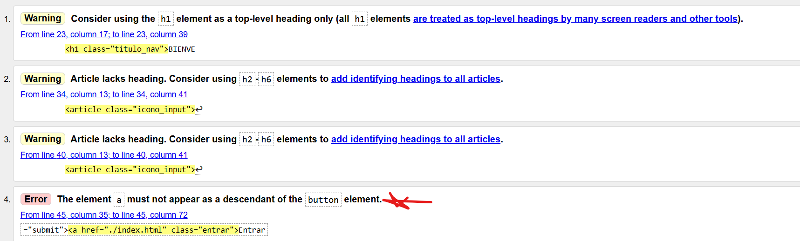

- La siguiente Imagen es del REGISTER en este caso, y obtendremos el mismo error que en el LOGIN, el cual tiene ambas intenciones.
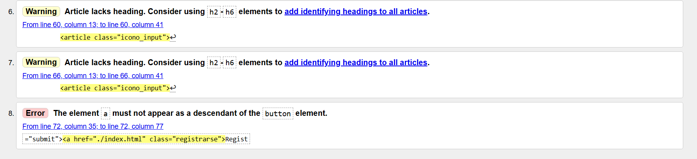

- En esta ocasion, nos da un error el cual vamos a permitir, el hr simplemente nos está haciendo una separación entre 2 ul, como queremos que la linea separativa este entre las listas de los filtros, ese hr debe estar ahi.
")

**2. Validación del Código HTML**

- Muestro aqui una de las capturas del CSS, todas son iguales, no he recibido ningun error en las hojas de estilo, por lo que mostrare una tan solo.
")

**3. Optimización y comprobación de accesibilidad, usabilidad**

Los códigos del CSS estan exclusivamente realizados para cada página, excepto header_footer.css.

**- Tras un proceso de optimizar todas y cada unas de las imagenes que usamos en el proyecto, el peso de estas pasa de:**

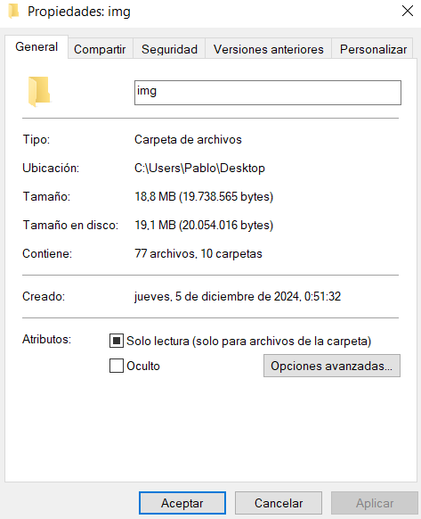

**- Tras el proceso de optimización de todas estás:**

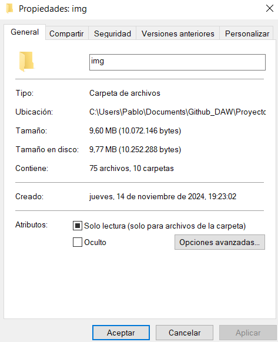

**- COMPROBACIÓN EN DISTINTOS NAVEGADORES**
- La web ha sido comprobada en distintos navegadores, y tiene un funcionamiento correcto!

**- COMPROBACION EN LIGHTHOUSE**
- PRUEBA INDEX
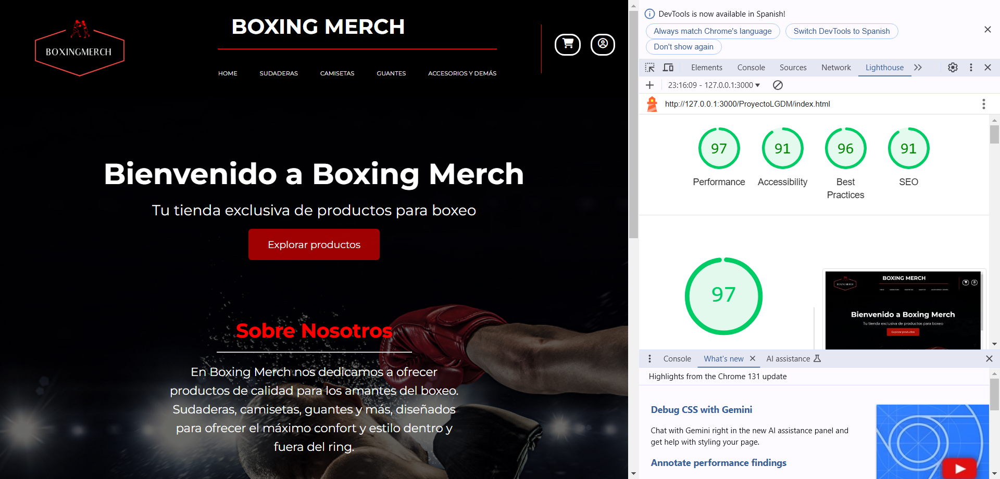
- PUEBA LOGIN
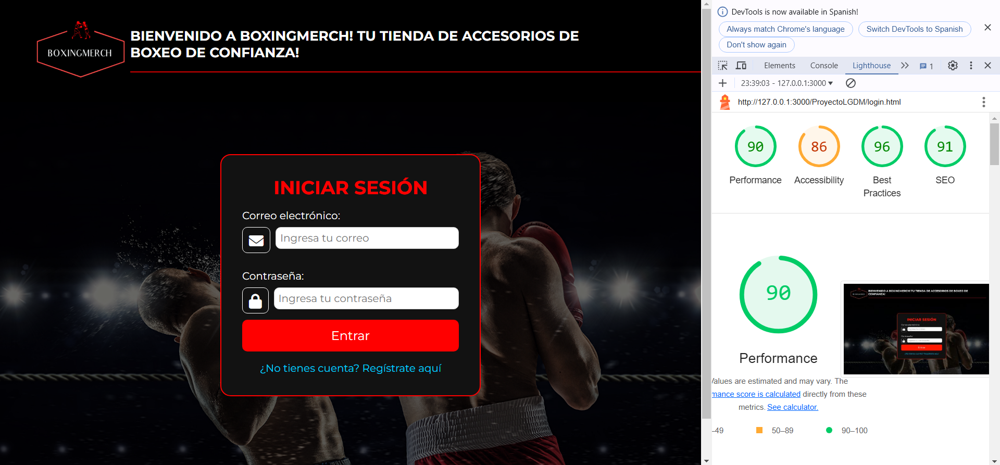
- PUEBA REGISTER
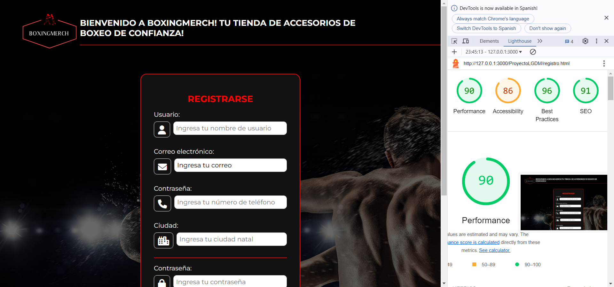
- PUEBA PERFIL
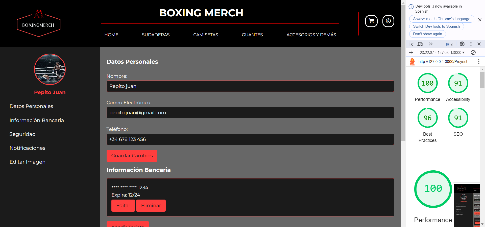
- PUEBA CESTA
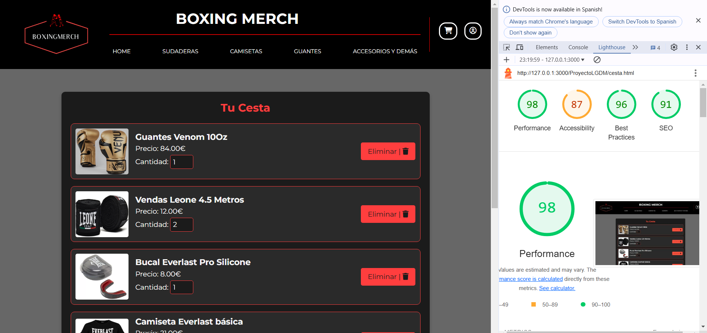
- PRUEBA SUDADERAS
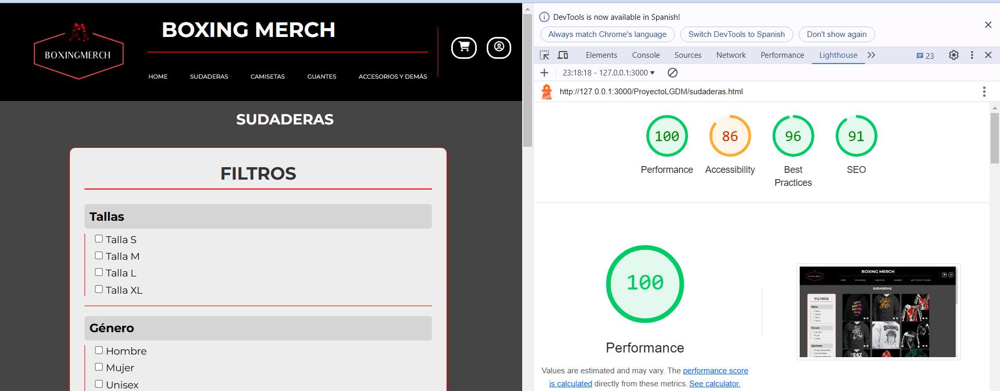
- 
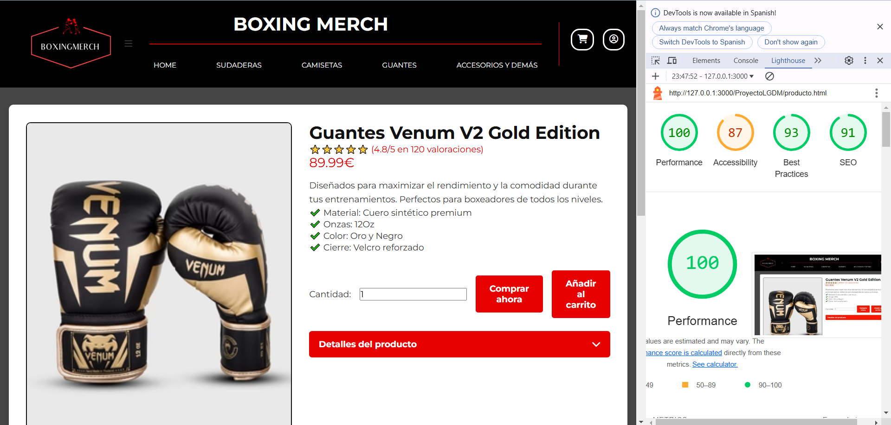

**4. Producto: Informe de accesibilidad y mejoras aplicadas al proyecto.**

Todo informe, mejora, etc. Ha sido indicada y corregida en los apartados anteriores.